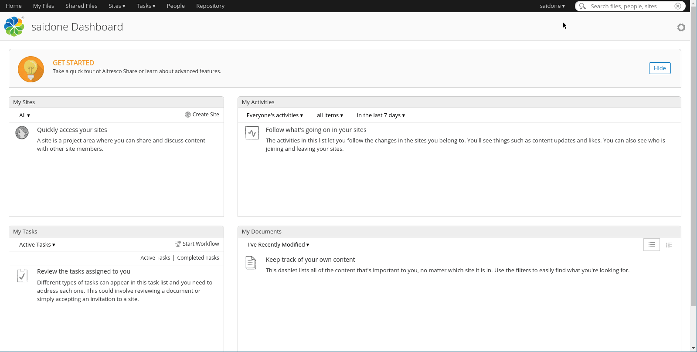
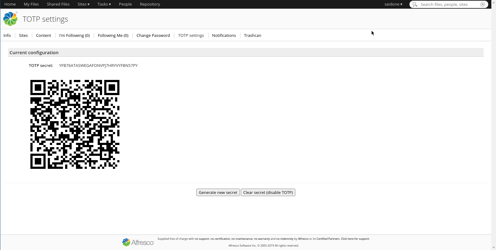

# Alfresco TOTP authenticator
Time-based One-Time Password two factor authentication for Alfresco

[](https://www.gnu.org/licenses/gpl-3.0)


[](https://vimeo.com/507443676)

Distributed for free without any warranty. Use at your own risk.

Tested with **Alfresco Community Edition 7.2**.

[](https://vimeo.com/507443676)

## Instructions
### Build
Get the sources:
```console
$ git clone https://github.com/saidone75/alfresco-totp-authenticator.git
```
build the AMPs:
```console
$ cd alfresco-totp-authenticator
$ mvn package
[INFO] Scanning for projects...
[INFO] ------------------------------------------------------------------------
[INFO] Reactor Build Order:
[INFO]
[INFO] alfresco-totp-authenticator-platform Platform/Repository JAR Module [jar]
[INFO] alfresco-totp-authenticator-share Share JAR Module                 [jar]
[INFO] alfresco-totp-authenticator                                        [pom]
[INFO]
[INFO] ----------< org.saidone:alfresco-totp-authenticator-platform >----------
[INFO] Building alfresco-totp-authenticator-platform Platform/Repository JAR Module 1.0-SNAPSHOT [1/3]
[...]
[INFO] --------------< org.saidone:alfresco-totp-authenticator >---------------
[INFO] Building alfresco-totp-authenticator 1.0-SNAPSHOT                  [3/3]
[INFO] --------------------------------[ pom ]---------------------------------
[INFO] ------------------------------------------------------------------------
[INFO] Reactor Summary for alfresco-totp-authenticator 1.0-SNAPSHOT:
[INFO]
[INFO] alfresco-totp-authenticator-platform Platform/Repository JAR Module SUCCESS [ 22.460 s]
[INFO] alfresco-totp-authenticator-share Share JAR Module . SUCCESS [  3.956 s]
[INFO] alfresco-totp-authenticator ........................ SUCCESS [  0.000 s]
[INFO] ------------------------------------------------------------------------
[INFO] BUILD SUCCESS
[INFO] ------------------------------------------------------------------------
[INFO] Total time:  26.659 s
[INFO] Finished at: 2021-01-27T16:01:04+01:00
[INFO] ------------------------------------------------------------------------
```
### Installation
Install the AMPs against alfresco.war and share.war using the Module Management Tool (MMT):
```
$ java -jar alfresco-mmt.jar install ./alfresco-totp-authenticator-platform/target/alfresco-totp-authenticator-platform-1.0-SNAPSHOT.amp alfresco.war
$ java -jar alfresco-mmt.jar install ./alfresco-totp-authenticator-share/target/alfresco-totp-authenticator-share-1.0-SNAPSHOT.amp share.war
```
and restart Alfresco.
### Configuration
- Log into Alfresco
- Go to your profile page and click on *TOTP settings* tab
- Click on *Activate TOTP* button to generate a secret and activate TOTP authentication
- Import the secret on your favourite OTP application (e.g. by scanning the QR Code), personally I use [andOTP](https://github.com/andOTP/andOTP) on Android but there's plenty of choices

Take a look at this short explanation video [here](https://vimeo.com/507443676).

### Pre-built AMPs
Stable [releases](https://github.com/saidone75/alfresco-totp-authenticator/releases) include the related build.
Java CI successful workflows on [Actions](https://github.com/saidone75/alfresco-totp-authenticator/actions) will issue development artifacts.

## License
Copyright (c) 2021-2022 Saidone

Distributed under the GNU General Public License v3.0
